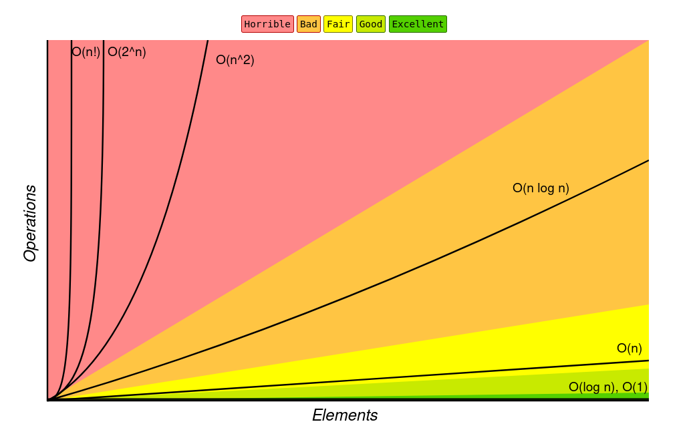

# Big-O Complexity



> Decreasing Order of Complexity:

**`O(N!)` > `O(2^N)` > `O(N^2)` > `O(N*logN)` > `O(N)` > `O(logN)` > `O(1)`**

## Examples

```txt
int a = 0;
for (i = 0; i < N; i++) {
    for (j = N; j > i; j--) {
        a = a + i + j;
    }
}
```

```txt
(N -> 0) + (N -> 1) + (N -> 2) + ... + (N -> N)
= (N) + (N-1) + (N-2) + ... + (1)
= (N*(N+1))/2
= O(N^2)
```
