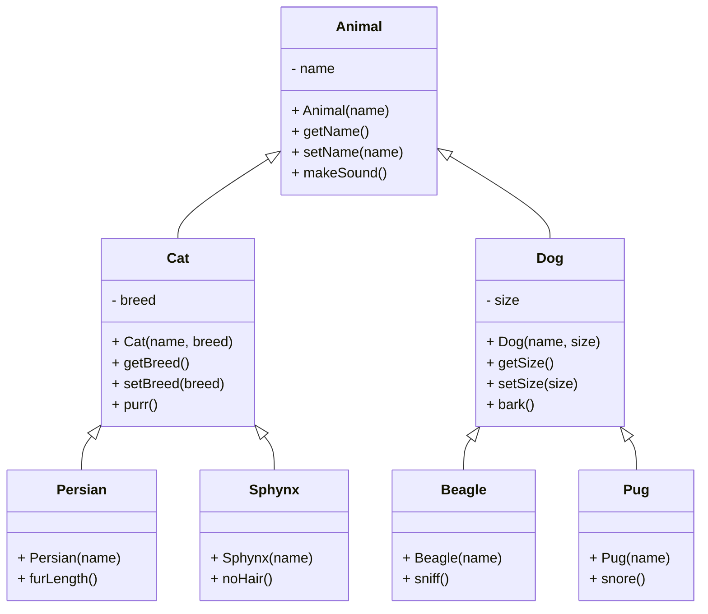

These are the four pillars of Object-Oriented Programming:

## 1. Encapsulation


- It refers to the practice of wrapping the state (data members) and functions manipulating it (methods) together into a single unit (class)
- The data members are best to be kept `private` (or `protected`) and then define `public` **getters or setters** for accessing or modifying the state from outside the class, as and when required. We can decide which data is visible/mutable to others and which isn't. Thus, encapsulation is also called as **data-hiding**
- This packing of state and methods to the class makes code easier to control, test and maintain
- The class contains a **"has-a"** relationship with it's data members

## 2. Abstraction

- It refers to **hiding the complex implementation details** from the user and only displaying the important information. We provide only a high-level view of the system by focusing on what the system can do rather than how the system does it.
- For example, if we have a coffee machine, we only provide one `Make Coffee` button to the user. The internal implementation of making the coffee involves multiple steps such as boiling water, frothing milk, mixing them etc. User doesn't need to know this entire complex procedure; he can just press the button and receive fresh coffee.
- Also, we can update our implementation of the procedure to a better approach while the way to use it remains the same for the end user.
- **Abstract classes** and **Interfaces** provide a way to define common characteristics and behaviors shared by multiple classes without specifying their implementation details.
- It promotes ease-of-use and interoperability
- Some examples are:

  - Defining a specification and leaving it's implementation up to the vendors
  - Application Programming Interfaces (APIs) provide developers with functions to interact with a platform without exposing how they work
  - Abstract Data Type (ADT) of a data-structure only defines which properties and methods it has, not how they should be implemented

```java title="Stack ADT"
public interface StackADT<T> {
    boolean isEmpty();
    int size();
    void push(T element);
    T pop();
    T peek();
}
```

Abstraction and encapsulation support each other. If you don’t group like things together, then you’re going to have a harder time abstracting them. They’ll have to be passing data back and forth.

## 3. Inheritance

- Inheritance allows you to create new classes (subclasses) that derive properties and behaviors from existing (parent) class.
- We extend all of the parent class' characteristics into a more specialized child class adding some extra or modified characteristics without writing the original class' features again. Thus, inheritance allows code **reusability**
- Inheritance represents an **"is-a"** relationship between the parent and child classes. For example an `Apple` is a kind of `Fruit` would be expressed as the `Apple` class inheriting the `Fruit` class
- We get a hierarchial structure of related classes as our application grows in complexity



## 4. Polymorphism

- The word polymorphism is derived from Greek and means "**having multiple forms**"
- It refers to the use of a single symbol, typically a method name (or operator) to represent multiple different types of functionalities. It's ability of objects to take on different behaviors depending on their context
- Polymorphism in OOP is mainly of two types:

  1. **Static (Compile-time)** polymorphism: achieved through method (or operator) **overloading**

  2. **Dynamic (Run-time)** polymorphism: achieved through method **overriding**
