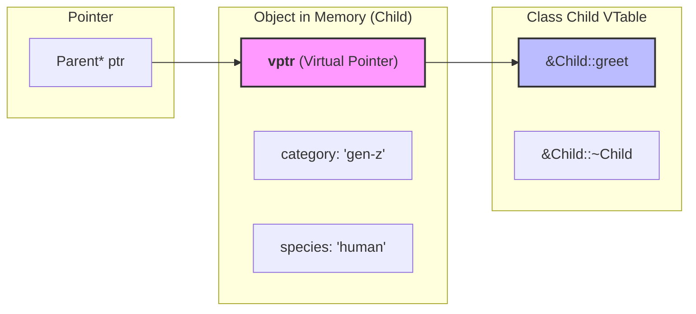

**Contents**:

- [Compile-time Polymorphism (static-binding)](#compile-time-polymorphism-static-binding)
  - [Method Overloading](#method-overloading)
  - [Operator Overloading](#operator-overloading)
- [Static vs Dynamic Binding](#static-vs-dynamic-binding)
- [Runtime Polymorphism (dynamic-binding)](#runtime-polymorphism-dynamic-binding)
  - [Method Overriding](#method-overriding)
  - [Upcasting](#upcasting)
  - [Variable Shadowing (Name-Hiding)](#variable-shadowing-name-hiding)
  - [How Dynamic Binding works in C++](#how-dynamic-binding-works-in-c)
  - [Virtual Destructor in C++](#virtual-destructor-in-c)
  - [How Java handles things](#how-java-handles-things)

**Polymorphism**, at its core, allows for _flexible_ code in object-oriented programming. It essentially means "having many forms" and **lets objects or functions exhibit different behaviors in various contexts**. It enables code to be written in a more generic and flexible manner, allowing for more modular and extensible design.

Polymorphism is mainly of two types: compile-time (static-binding) or runtime (dynamic-binding)

## Compile-time polymorphism (Static-binding)

Since the **compiler can definitively determine which function to call** based on the information available at the time of compilation, it's called static polymorphism. Static polymorphism is achieved via **method overloading** or **operator overloading**

### Method Overloading

We can have multiple methods with the exact **same name** but **different method signatures** and the compiler is able to decide which method to call. A method's signature includes:

- **number** of parameters
- **data-types** of respective parameters
- **order** of passing the parameters

> Note that the **return type** of a method is **NOT** a part of it's signature

```cpp title="Invalid method overload"
// Although return-type different, signatures same, which throws a Compilation Error
void add(int a, int b) { cout << a + b << endl; }
int add(int a, int b) { return a + b; }
```

```cpp title="Method overloading in C++"
// Calculates Area of Rectangle
double calculateArea (int length, int breadth) { // Takes two integers as input
    return length * breadth;
}

// Calculates Area of Circle
double calculateArea (int radius) { // Takes one integer as input
    return M_PI * radius * radius;
}

int main () {
    int l = 5, b = 7;
    cout << "Area of Rectangle: " << calculateArea(l, b) << endl;
    int r = 6;
    cout << "Area of Circle: " << calculateArea(r) << endl;
    return 0;
}
/* Output:
Area of Rectangle: 35
Area of Circle: 113.097
*/
```

Some examples of declaring overloads of method `logMsg` having different signatures are shown below:

```cpp title="Declaring method overloads in C++"
void logMsg(string msg);
void logMsg(int count);
void logMsg(string msg, int priority);
void logMsg(int priority, string msg);
void logMsg(int count, string msg, int priority);
```

There is typically no inheritance of classes involved in overloading, so all overloaded methods are in **same class**

```java title="Method overloading in Java"
class Demo {
    static double calculateArea(int length, int breadth) { // Takes two integers as input
        return length * breadth;
    }

    static double calculateArea(int radius) { // Takes one integer as input
        return Math.PI * radius * radius;
    }

    public static void main(String[] args) {
        int l = 5, b = 7;
        int r = 6;
        System.out.println("Area of Rectangle: " + calculateArea(l, b));
        System.out.println("Area of Circle: " + calculateArea(r));
        /* Output:
        Area of Rectangle: 35.0
        Area of Circle: 113.09733552923255
        */
    }
}
```

### Operator Overloading

This feature is available in C/C++ but **NOT in Java**

```cpp title="Operator Overloading in C++"
class Point {
  private:
    int x, y;

  public:
    Point (int _x = 0, int _y = 0) : x(_x), y(_y) {}

    // Overload == and != operators to compare two Point objects by value
    bool operator==(const Point& other) const {
        return (this->x == other.x) && (this->y == other.y);
    }
    bool operator!=(const Point& other) const { return !(*this == other); }

    // Overload << operator in output stream class (ostream) to print its members
    // Making ostream class as friend allows it to access private members of Point
    friend ostream& operator<<(ostream& out, const Point& p) {
        out << "(" << p.x << ", " << p.y << ")";
        return out;
    }
};

int main () {
    Point p1(9, 3), p2(6, 2), p3{9, 3}, p4;

    // ostream << operator overload in action:
    cout << "Point p1: " << p1 << endl;  // Point p1: (9, 3)
    cout << "Point p2: " << p2 << endl;  // Point p2: (6, 2)
    cout << "Point p3: " << p3 << endl;  // Point p3: (9, 3)
    cout << "Point p4: " << p4 << endl;  // Point p4: (0, 0)

    // Equality check operator overloads in action:
    cout << (p1 == p2) << endl;  // 0 (false)
    cout << (p1 == p3) << endl;  // 1 (true)
    cout << (p1 != p2) << endl;  // 1 (true)

    return 0;
}
```

## Static vs Dynamic Binding

The difference comes down to **when** the function call is mapped to its exact memory address:

- **Overloading (Static Binding / Early Binding):** Resolved at **compile time**. The compiler looks at the function signature directly at the call site. Because all this information is fixed in the source code, the compiler **hardcodes** a direct call to the exact implementation in the compiled binary (via [Name Mangling](https://en.wikipedia.org/wiki/Name_mangling)).

- **Overriding (Dynamic Binding / Late Binding):** Resolved at **runtime**. When calling an overridden method through a base class pointer/reference, the compiler cannot know the actual object type pointing to that memory address beforehand. The decision of which function body to execute is deferred until execution time using dynamic lookup tables.

## Runtime polymorphism (Dynamic-binding)

### Method Overriding

Method overriding involves methods with same name and signature, but different implementations across class hierarchies. In below examples, the `Child` class is derived class from base class `Parent`. The base class has `greet()` method implementation, but we override that method in derived class having a different implementation

```cpp title="Method Overriding in C++"
class Parent {
  protected:
    string category = "millennial";
    string species = "human";

  public:
    virtual ~Parent () {} // Destructor marked as virtual

    virtual void greet (string name) {
        string greeting = "Hello " + name + ". I am a " + category + " " + species;
        cout << greeting << endl;
    }
};

class Child : public Parent {
  protected:
    string category = "gen-z";

  public:
    void greet (string name) override {
        string greeting = "Ssup " + name + ". I am a " + category + " " + species + ". My dad is " + Parent::category;
        cout << greeting << endl;
    }
};

int main () {
    // Generic pointer that can point to either of "Parent" or "Child" class object
    Parent* ptr;

    // -------- HEAP Allocation ---------------------
    ptr = new Parent();  // Create "Parent" object on heap and make "ptr" point to it
    ptr->greet("Jack");  // Hello Jack. I am a millennial human
    delete ptr;          // Delete Parent object pointed by ptr

    ptr = new Child();   // Create "Child" object on heap and make "ptr" point to it
    ptr->greet("Jack");  // Ssup Jack. I am a gen-z human. My dad is millennial
    delete ptr;          // Delete "Child" object via pointer of "Parent" class (needs virtual Parent destructor)

    // -------- STACK Allocation ---------------------
    Parent p1;  // Create "Parent" object on Stack referenced by "p1"
    Child c1;   // Create "Child" object "c1" on Stack referenced by "c1"

    ptr = &p1;          // Make "ptr" point to address of "p1"
    p1.greet("Sam");    // Hello Sam. I am a millennial human
    ptr->greet("Sam");  // Hello Sam. I am a millennial human

    ptr = &c1;          // Make "ptr" point to address of "c1"
    c1.greet("Sam");    // I am a gen-z human. My dad is millennial
    ptr->greet("Sam");  // I am a gen-z human. My dad is millennial

    return 0;
}
```

```java title="Method Overriding in Java"
import java.util.Locale;

class Parent {
    protected String category = "millennial";
    protected String species = "human";

    public void greet(String name) {
        String greeting = String.format(Locale.US,
            "Hello %s. I am a %s %s",
            name, category, species
        );
        System.out.println(greeting);
    }
}

class Child extends Parent {
    protected String category = "gen-z";

    @Override
    public void greet(String name) {
        String greeting = String.format(Locale.US,
            "Ssup %s. I am a %s %s. My dad is a %s",
            name, category, species, super.category
        );
        System.out.println(greeting);
    }
}

public class Demo {
    public static void main(String[] args) {
        // Generic reference that can point to either "Parent" or "Child" class object
        Parent ref;

        ref = new Parent();
        ref.greet("Jack"); // Hello Jack. I am a millennial human

        ref = new Child();
        ref.greet("Jack"); // Ssup Jack. I am a gen-z human. My dad is a millennial
    }
}
```

### Upcasting

Upcasting is the process of assigning a derived class reference/pointer to a base class reference/pointer. Note how in below example, we are assigning a `Child` class object to a pointer/reference of `Parent` class

```cpp
Parent* ptr = new Child();  // Upcasting for C++ example below
Parent ref = new Child();   // Upcasting for Java example below
```

It forms the bedrock of runtime polymorphism. Upcasting enables treating diverse derived objects uniformly as instances of a common base type such as storing `Circle`, `Square`, and `Triangle` objects in a `vector<Shape*>`

Upcasting is always safe and **implicit** because a derived object _is-a_ base object; it contains all members of the base class, so no explicit type-casting is required.

### Variable Shadowing (Name-Hiding)

A common misconception is that member variables undergo dynamic dispatch just like methods. However, **member variables are shadowed, not overridden**. This is also known as Name-Hiding. Unlike methods, member variables do not participate in dynamic polymorphism in either C++ or Java.

```txt
+----------------------------------------------------+
| Child Object Memory Layout                         |
|  +----------------------------------------------+  |
|  | Parent Sub-object                            |  |
|  |   String category = "millennial"             |  |
|  +----------------------------------------------+  |
|  | Child Fields                                 |  |
|  |   String category = "gen-z" (Shadows) Parent |  |
+----------------------------------------------------+
```

- **Memory Layout and Dual Storage**: When a derived class re-declares a variable with the same name as a base class variable, it does not replace it. Instead, the derived object holds both variables in memory side by side.
- **How Resolution Works**: Variable resolution is determined strictly at compile time using the type of the reference or pointer

In below examples, see how both copies of `category` variable are available to `Child` class, one from `Parent` and one of `Child` itself. By default, the `Parent` `category` is shadowed i.e. hidden by the `Child` one, but can still be accessed via `Parent::category` (C++) or `super.category` (Java)

### How Dynamic Binding works in C++

> In **C++**, function calls are bound **statically** by default. To enable dynamic binding and method overriding, you must explicitly mark base class functions with the `virtual` keyword. However, in **Java**, all non-static, non-private instance methods are `virtual` by default.

- In **C++**, methods are non-virtual by default (opt-in). Marking a function `virtual` tells the compiler to opt into runtime dispatch by creating a lookup table for the class and attaching a hidden pointer to every instance.
- **The `override` Specifier:** While not mandatory for dynamic binding, adding `override` in the child class forces the compiler to check that the method signature matches the base `virtual` function, preventing silent bugs from typos in parameter types.

If the base class method `Parent::greet()` was not marked `virtual`, C++ defaults to static-binding based on the pointer type, not the underlying object. As a result, the compiler looks strictly at the static type of `ptr` i.e. `Parent*`, sees a non-virtual function, and hardcodes a call to `Parent::greet()`. Method overriding would fail silently when calling `greet()` on `Child` class object pointed by `Parent*`.

When a class contains `virtual` methods, C++ switches from direct function calls to indirect dispatch via two compiler-generated structures: VTable and VPointer.



- **VTable (Virtual Table):** A static lookup table generated by the compiler once per class that has at least one virtual method. It stores function pointers to the most-derived implementations of the virtual functions for that class.
- **VPointer (`vptr`):** A hidden pointer automatically added by the compiler to the memory layout of every object instance of a class with virtual methods. During object construction, `vptr` is initialized to point directly to its class's VTable.

The **Dispatch Sequence** at Runtime:

When executing `ptr->greet("Jack");` through a `Parent*` pointer pointing to `Child` object

1. **Dereference Object**: The runtime dereferences ptr to access the instance in memory.
2. **Fetch `vptr`**: It extracts the hidden `vptr` located at the object's offset.
3. **Lookup Method Slot**: It accesses the fixed slot corresponding to greet() in the VTable pointed to by `vptr`.
4. **Jump & Execute**: It jumps to the function address found (`Child::greet`) and executes it.

Performance Trade-off: Dynamic dispatch adds a minor overhead (one extra pointer dereference and a cache lookup) compared to the single assembly call instruction of static-binding.

### Virtual Destructor in C++

When deleting an object allocated on the heap via a base class pointer, the destructor resolution depends on whether the base destructor is marked `virtual`. In above example, we have marked the `~Parent()` destructor as `virtual` to allow deletion of `Child` object via a pointer of `Parent` class when `delete ptr;` was executed

- If the `Parent::~Parent()` is non-virtual, the deletion step would use **static-binding**. The compiler only invokes base class destructor `Parent::~Parent()`. The derived class destructor `Child::~Child()` never executes, leaking any heap resources allocated inside `Child`.
- With a `virtual` destructor `virtual ~Parent()`, the deletion step uses **dynamic dispatch**. The derived class destructor `Child::~Child()` is called first to free derived resources. It automatically **chains upward** to call base class destructor `Parent::~Parent()`.

> Rule of Thumb: Always mark the destructor `virtual` in any C++ class that contains at least one `virtual` method or is intended to be inherited from.

### How Java handles things

- In Java, all instance methods are **virtual by default**. You do not need a `virtual` keyword. Dynamic-binding applies automatically unless a method is explicitly declared `final`, `private`, or `static`.
- Java uses `@Override` annotation as a compiler safeguard (similar to C++'s `override` specifier) to ensure the method correctly matches a superclass method signature.
- **No Operator Overloading**: Java deliberately omitted operator overloading to keep the language simple and readable (with the sole built-in exception of the `+` operator for String concatenation).
- **VTables in JVM**: Under the hood, the JVM use a `vtable` structure inside the method area/klass structure similar to C++ to resolve dynamic dispatch at runtime.
