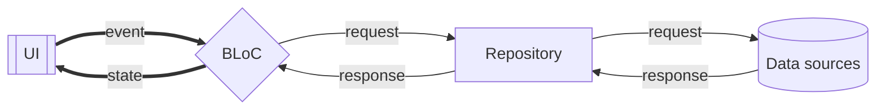
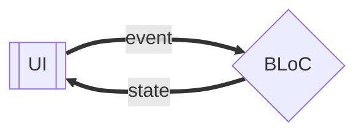
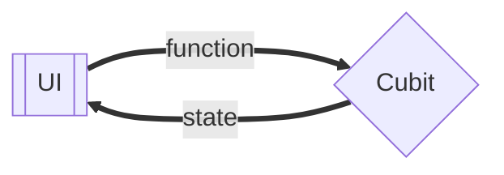

## What is BLoC?

In large complex applications, you should not mix your **UI** and **Data Logic** together in one place. There should be an intermediary between the two for the **separation of concerns** and a more organized codebase

BLoC is an acronym for **Business-Logic Components**. BLoC was created with three guiding principles in mind:

- **Simple**: Easy to grasp and can be used by developers of all skill levels.
- **Powerful**: Assist in the creation of remarkable, sophisticated applications by breaking them down into smaller components.
- **Testable**: We can easily test every part of an application so we can confidently iterate.

There are four main layers of application in the BLoC pattern:

1. **UI** : The UI contains all of the application’s components that the user can see and interact with.
1. **BLoC** : The bloc is the layer between the data and the UI components. The bloc receives events from an external source and emits a state in response to the received event.
1. **Repository** : The repository is designed to be the single source of truth, it is responsible for organizing data from the data source(s) to be presented by the UI.
1. **Data providers** : The data providers are responsible for fetching the application data, they are characterized by network calls and database interactions.



## Events

Events are **input** to a bloc, they’re usually added as a **result of user activities** like button pushes, or lifecycle events like page loads. You can model your event as anything, from a primitive data type, such as an integer, to any complex abstracted classes.

```dart title="auth_events.dart"
abstract class AuthEvent {}
class LoginEvent extends AuthEvent {}
class LogoutEvent extends AuthEvent {}
```

## States

States are an **output** of a bloc, they represent the application state. The **UI components listen to a state change and redraw a portion of themselves** based on the current state. The state can also be modeled as anything from a primitive data type, such as an integer, to any complex abstracted classes.

```dart title="auth_states.dart"
abstract class AuthState {}
class UnAuthenticatedState extends AuthState {}
class AuthenticatedState extends AuthState {}
```

## Bloc

A bloc uses an event to trigger a state change. Blocs are event receivers that **_turn incoming events into outgoing states_**. It emits a state when an event occurs



```dart
// Bloc < EventType, StateType >
class AuthBloc extends Bloc<AuthEvent,AuthState> {
  // Initial default state is UnAuthenticatedState
  AuthBloc(): super(UnAuthenticatedState());
}
```

To emit a new state, you need to handle triggered events. To do this, you will have to register an event handler using the on `<Event>` API inside the constructor body as follows

```dart title="auth_bloc.dart"
class AuthBloc extends Bloc<AuthEvent,AuthState> {
  AuthBloc(): super(UnAuthenticatedState()) {
    on <LoginEvent> (
      (event, emit) => emit(AuthenticatedState())
    );
    on <LogoutEvent> (
      (event, emit) => emit(UnAuthenticatedState())
    );
  }
}
```

> Blocs should **never emit new states directly**, rather every state change should be emitted from the EventHandler.

---

## Cubit

A cubit is a class that manages any kind of state by **exposing functions that can be evoked to trigger state changes**

Unlike a bloc, a cubit doesn’t use events to trigger state changes. Instead it exposes functions to trigger the state changes.



Cubit is created by extending the cubit generic class and defining the state like this;

```dart
class AuthCubit extends Cubit<AuthState> {
  AuthCubit(): super(UnAuthenticatedState());
}
```

To emit a new state, you will have to call a function on the cubit object, each cubit can emit a new state using the emit method as below:

```dart
AuthCubit(): super(UnAuthenticatedState());
void login() => emit(AuthenticatedState());
void logout() => emit(UnAuthenticatedState());
```

As the `emit()` method is protected, it should **only be used within a cubit**

Consider an example of `CounterCubit`:

```dart title="counter_cubit.dart"
class CounterCubit extends Cubit<int> {
  CounterCubit() : super(0);

  void increment() => emit(state + 1);
  void decrement() => emit(state - 1);
}
```

```dart title="main.dart"
void main() => runApp(CounterApp());

class CounterApp extends StatelessWidget {
  @override
  Widget build(BuildContext context) {
    return MaterialApp(
      home: BlocProvider(
        create: (_) => CounterCubit(),
        child: CounterPage(),
      ),
    );
  }
}
```

```dart title="counter_page.dart"
class CounterPage extends StatelessWidget {
  @override
  Widget build(BuildContext context) {
    return Scaffold(
      appBar: AppBar(title: const Text('Counter')),
      body: BlocBuilder<CounterCubit, int>(
        builder: (context, count) => Center(child: Text('$count')),
      ),
      floatingActionButton: Column(
        crossAxisAlignment: CrossAxisAlignment.end,
        mainAxisAlignment: MainAxisAlignment.end,
        children: <Widget>[
          FloatingActionButton(
            child: const Icon(Icons.add),
            onPressed: () => context.read<CounterCubit>().increment(),
          ),
          const SizedBox(height: 4),
          FloatingActionButton(
            child: const Icon(Icons.remove),
            onPressed: () => context.read<CounterCubit>().decrement(),
          ),
        ],
      ),
    );
  }
}
```

At this point we have successfully separated our presentational layer from our business logic layer. Notice that the CounterPage widget knows nothing about what happens when a user taps the buttons. The widget simply notifies the CounterCubit that the user has pressed either the increment or decrement button.

---

## `BlocListener` vs `BlocBuilder` vs `BlocConsumer`

### `BlocListener`

- Invokes the `listener` in response to `state` changes in the bloc
- Should be used for functionality that needs to occur only in response to a `state` change (**navigation**, show `SnackBar` or `Dialog`)
- The `listener` is guaranteed to only be called once for each `state` change unlike the `builder` in `BlocBuilder`
- Use `BlocListener` if you want to **do** anything in response to state changes

```dart
BlocListener<BlocA, BlocAState>(
  listener: (context, state) {
    // do stuff here based on BlocA's state
  },
  child: Container(),
  value: blocA,  // ONLY to provide a bloc that is otherwise not accessible via BlocProvider and the current BuildContext
  listenWhen: (previous, current) {...}, // More granular control over when listener is called
)
```

### `BlocBuilder`

- handles building a widget in response to new `states`
- If the `bloc` parameter is omitted, `BlocBuilder` will automatically perform a lookup using `BlocProvider` and the current `BuildContext`
- You can use a `BlocBuilder` inside a `BlocListener`

```dart
BlocBuilder<BlocA, BlocAState>(
  builder: (context, state) {
    return someWidget // some widget based on BlocA's state
  },
  bloc: blocA, // ONLY to provide a bloc that is otherwise not accessible via BlocProvider and the current BuildContext
  buildWhen: (previous, current) {...}, // optional for more granular control over how often BlocBuilder rebuilds
)
```

### `BlocConsumer`

- Exposes a `builder` and `listener` in order react to new `state`
- Analogous to a nested `BlocListener` and `BlocBuilder` but reduces the amount of boilerplate needed
- Should ONLY be used when it is necessary to BOTH **rebuild UI and execute other reactions** to state changes in the bloc

```dart
BlocConsumer<BlocA, BlocAState>(
  listener: (context, state) {
    // do stuff here based on BlocA's state
  },
  builder: (context, state) {
    return someWidget; // some widget based on BlocA's state
  },
  // Optional for more granular control over when listener and builder are called
  listenWhen: (previous, current) {...},
  buildWhen: (previous, current) {...}
)
```

> `listener` executes ONLY when some state is emitted, `builder` executes always

---

## References

- [Getting Started with Flutter BLoC | topcoder](https://www.topcoder.com/thrive/articles/getting-started-with-flutter-bloc)
- [Bloc concepts](https://bloclibrary.dev/bloc-concepts/)
- [Bloc Architecture](https://bloclibrary.dev/bloc-concepts/)
- **Tutorials**:
  - [Bloc State Management - From Beginner to Advanced in 11 Hours](https://youtu.be/Mn254cnduOY?si=XREhN1O4sOM36RjD)
  - [Flutter State Management - The Grand Tour | Fireship](https://youtu.be/3tm-R7ymwhc?si=q8qvn_ReMq9Xd5tG&t=530)
  - [Akshit Madan Bloc playlist](https://www.youtube.com/playlist?list=PL9n0l8rSshSkzasAAyVMozHQu8-LdWxI0)
