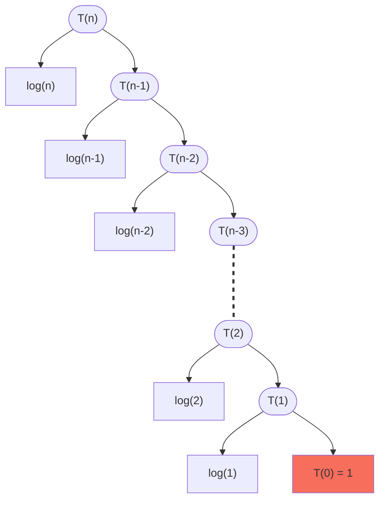

## Recurrence relation

A recurrence relation is an equation that recursively defines elements in a sequence of numbers as a function of the preceeding one(s)

**Order**: The order of a recurrence relation refers to the highest difference between the subscripts of the term being defined and the preceding terms used in the equation. It essentially tells you **how far back you need to look** in the sequence to calculate the n<sup>th</sup> term

**Initial Terms**: These are the **starting seed values** of the sequence you need to kick off the calculations using the recurrence relation.

## 1. Factorial of a number

The factorial function is defined as:

\\( f(n) = \begin{cases} 1 & \text{if n = 0} \\\\ n \ast f(n-1) & \text{if n > 0} \end{cases} \\)

And the recurrence relation can be written as:

\\( \boldsymbol{F\_{n} = n \ast F\_{n-1}} \space\space \text{with} \space\space F_0 = 1 \\)

Here, the order is **1** and number of initial terms is also **1**

## 2. Fibonacci number

The n<sup>th</sup> fibonacci number is given by function:

\\( f(n) = \begin{cases} 0 & \text{if n = 0} \\\\ 1 & \text{if n = 1} \\\\ f(n-1) + f(n-2) & \text{if n > 1} \end{cases} \\)

And the recurrence relation can be written as:

\\( \boldsymbol{F\_{n} = F\_{n-1} + F\_{n-2}} \space\space \text{with} \space\space F_0 = 0, \space F_1 = 1 \\)

Here, the order is **2** and number of initial terms is also **2**

---

In below examples, \\( T(n) \\) is the time required to execute as a function of the input size \\(n\\)

## Decreasing functions

The next recursive call is on a decremented input value

### Examples of decreasing functions

**Example 1**:

```cpp
void func(int n) {          // T(n)
    if (n > 0) {
        cout << n << endl; // 1
        func(n - 1);       // T(n-1)
    }
}
```

The recurrence relation for above recursive function is: \\[T(n) = T(n-1) + 1 \space\space\text{and assuming}\space T(0)=1 \\]

<br>

**Example 2**:

```cpp
void func(int n) {                    // T(n)
    if (n > 0) {
        for (int i = 0; i < n; i++) {
            cout << n << endl;        // n
        }
        func(n - 1);                  // T(n-1)
    }
}
```

The recurrence relation of above recursive function is: \\[T(n) = T(n-1) + n \space\space\text{and assuming}\space T(0)=1 \\]

<br>

**Example 3**:

```cpp
void func(int n) {                          // T(n)
    if (n > 0) {
        for (int i = 0; i < n; i *= 2) {
            cout << n << endl;              // log(n)
        }
        func(n - 1);                        // T(n-1)
        func(n - 1);                        // T(n-1)
    }
}
```

The recurrence relation of above recursive function is: \\[T(n) = 2T(n-1) + log(n) \space\space\text{and assuming}\space T(0)=1 \\]

---

## Master Theorem for evaluating Decreasing functions

Refer [Abdul Bari video](https://youtu.be/CyknhZbfMqc?si=85BGCrrSXTn04OKE)

Given any recurrence relation of the form:

\\[ \boldsymbol{T(n) = aT(n - b) + f(n)} \\]

\\[ \text{such that}\space\space a,b > 0 \space\text{and}\space \boldsymbol{f(n) = O(n^k)} \space\text{where}\space k \ge 0 \\]

It can be solved with the following cases:

**Case 1**:&emsp; \\( \boldsymbol{(a < 1)} \implies T(n) = \boldsymbol{O(f(n))} = O(n^k) \\)

**Case 2**:&emsp; \\( \boldsymbol{(a = 1)} \implies T(n) = \boldsymbol{O( f(n) \ast n ) } = O(n^{k+1}) \\)

**Case 3**:&emsp; \\( \boldsymbol{(a > 1)} \implies T(n) = \boldsymbol{O( f(n) \ast a^{n/b} )} = O( n^k \cdot a^{n/b} ) \\)

### Examples of decreasing function evaluated by Master theorem

1. \\( T(n) = T(n-1) + 1 \implies O(n) \\)
1. \\( T(n) = T(n-1) + n \implies O(n^2) \\)
1. \\( T(n) = T(n-1) + n^2 \implies O(n^3) \\)
1. \\( T(n) = T(n-1) + logn \implies O(n\cdot logn) \\)
1. \\( T(n) = T(n-3) + 1 \implies O(n) \\)
1. \\( T(n) = T(n-10) + n \implies O(n^2) \\)
1. \\( T(n) = 2T(n-1) + 1 \implies O(2^n) \\)
1. \\( T(n) = 3T(n-2) + n \implies O(n \cdot 3^{n/2}) \implies O( n \cdot ({\sqrt 3})^n ) \\)
1. \\( T(n) = \frac{1}{3}T(n-2) + logn \implies O(logn) \\)

---

## Dividing functions

The next recursive call is on a factored input value

### Examples of Dividing functions

**Example 1**:

```cpp
void func(int n) {            // T(n)
    if (n > 1) {
        cout << n << endl;    // 1
        func(n / 2);          // T(n/2)
    }
}
```

The recurrence relation for above recursive function is: \\[T(n) = T \left(\frac{n}{2} \right) + 1 \space\space\text{and assuming}\space T(1)=1 \\]

<br>

**Example 2**:

```cpp
void func(int n) {                        // T(n)
    if (n > 1) {
        for (int i = 0; i < n; i *= 2) {
            cout << n << endl;            // log(n)
        }
        func(n / 3);                      // T(n/3)
        func(n / 3);                      // T(n/3)
    }
}
```

The recurrence relation of above recursive function is: \\[T(n) = 2T \left(\frac{n}{3} \right) + logn \space\space\text{and assuming}\space T(1)=1 \\]

<br>

**Example 3**:

```cpp
void func(int n) {            // T(n)
    if (n > 2) {
        cout << n << endl;    // 1
        func(sqrt(n));        // T(sqrt(n))
    }
}
```

The recurrence relation of above recursive function is: \\[T(n) = T( \sqrt{n}) + 1 \space\space\text{and assuming}\space T(2)=1 \\]

---

## Master Theorem for evaluating Dividing functions

Refer [Abdul Bari video](https://youtu.be/OynWkEj0S-s?si=9hzLKP7lwPSS2XOL) and [Wikipedia page](<https://en.wikipedia.org/wiki/Master_theorem_(analysis_of_algorithms)>)

Given any recurrence relation of the form:

\\[ \boldsymbol{T(n) = aT \left(\frac{n}{b} \right) + f(n)} \\]

\\[ \text{such that}\space\space a\ge1,\space b > 1 \space\text{and}\space \boldsymbol{f(n) = \Theta(n^k \cdot log^p(n))} \space\text{where}\space k \ge 0 \\]

Here:

- '\\(n\\)' is the **input size**
- '\\(a\\)' is the **number of subproblems** in the recursion
- '\\(b\\)' is the **factor by which the subproblem size is reduced** in each recursive call
- '\\( f(n) \\)' is the **work to split/recombine** the problem
- The **critical exponent**: \\(c\_{crit} = log_b(a) = \frac{ log(\text{number of subproblems}) }{ log(\text{relative subproblem size}) } \\)

It can be solved with the following cases:

**Case 1**:&emsp; \\( \boldsymbol{log_b(a) > k} \implies T(n) = \boldsymbol{ \Theta( n^{log_b(a)} ) } \\)

**Case 2**:&emsp; \\( \boldsymbol{log_b(a) = k} \\) :

&emsp;(**2a**)&emsp; \\( \boldsymbol{p > -1} \implies T(n) = \boldsymbol{ \Theta( n^k \cdot log^{p+1}(n) ) } \\)

&emsp;(**2b**)&emsp; \\( \boldsymbol{p = -1} \implies T(n) = \boldsymbol{ \Theta( n^k \cdot log^{2}(n) ) } = \Theta(n^k \cdot log(log(n))) \\)

&emsp;(**2c**)&emsp; \\( \boldsymbol{p < -1} \implies T(n) = \boldsymbol{ \Theta(n^k) } \\)

**Case 3**:&emsp; \\( \boldsymbol{log_b(a) < k} \\) :

&emsp;(**3a**)&emsp; \\( \boldsymbol{p \ge 0} \implies T(n) = \boldsymbol{ \Theta(f(n)) = \Theta(n^k \cdot log^p(n)) } \\)

&emsp;(**3b**)&emsp; \\( \boldsymbol{p < 0} \implies T(n) = \boldsymbol{ \Theta(n^k) } \\)

---

## Tracing Recursion calls

```cpp
// Assuming base case: T(0) = 1
void func(int n){                           // T(n)
    if(n > 0){
        for(int i = 1; i < n; i *= 2){
            cout << i << endl;              // log(n)
        }
        func(n - 1);                        // T(n-1)
    }
}
```

The recurrence relation of above recursive function is: \\[T(n) = T(n-1) + log(n) \space\space\text{and assuming}\space T(0)=1 \\]

We can trace the recusive calls in a tree as:



So, the total time would be:

\\( T(n) = 1 + log(1) + log(2) + ... + log(n-2) + log(n-1) + log(n) \\)

\\( T(n) = 1 + log \left(1 \cdot 2 \cdot ... \cdot (n-2) \cdot (n-1) \cdot n \right) \\)

\\( T(n) = 1 + log(n!) \\)

\\( \text{We know } log(n!) \text{ is } O(n\cdot logn) \\) ... See [here](/code-journal/dsa/dsa/algorithm-complexity#asymptotic-notations)

\\( \therefore T(n) = O(n\cdot logn) \\)
