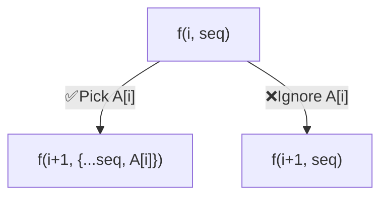
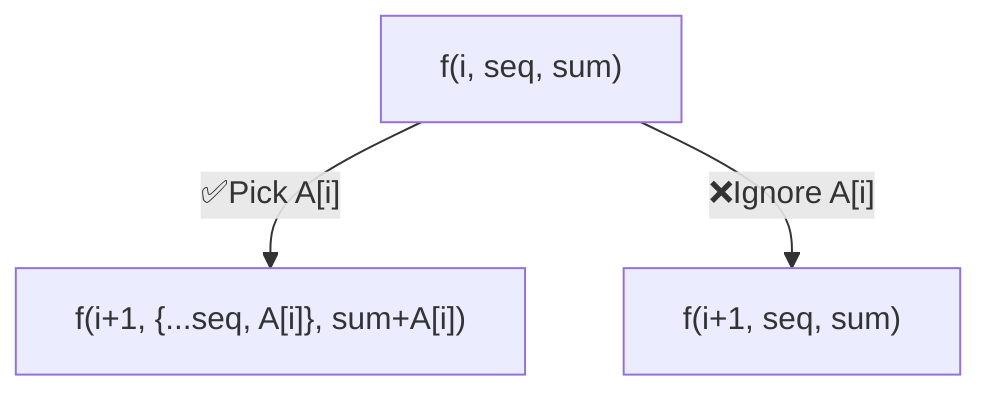

## How recursion solves a problem

When we are generating **ALL possible cases/solutions** for a problem, it results in a tree-like structure, commonly known as **State-space Tree** or **Decision Tree**

Each node represents a **partial/complete solution** (leaf nodes usually form a complete solution and intermediate nodes being partial solutions). These nodes are all the different possible **states** and each branch edge is a **transition** between two states.

This transition can be thought of as a **decision** made at a state. The number of transitions i.e. **branching** at a state would depend on the number of actions possible at that state

**Base case**: It is the **most-trivial** possible state generally indicating we have reached the end of a recursive exploration path. This prevents infinite nesting of recursive calls so it's quite a crucial component

To illustrate, consider an example:

> Print **ALL subsequences** of an array `A[] = {5,9,8}`

Here, we are traversing one element at a time and at each element, we decide either to:

- include it in ongoing sequence i.e. PICK✅ it
- NOT include it in ongoing sequence i.e. IGNORE❌ it

The tracker variable passed within functions is the **index** `i` of current element. Also, we would need to track the **sequence formed** at each point of traversal which is `seq` . The decision branching at each index can be represented as below:



The **base-case** would be when current index is **out of bounds of array** i.e. when current index equals length of array. The recursion tree generated in the process of traversing all possible solutions is shown below. Note the red boxes are the recursive calls being terminated the base case


```cpp title="C++ code implementation"
// Recursive helper function
void func (
    const size_t idx,
    vector<int> &seq,
    vector<vector<int>> &ans,
    const vector<int> &A
) {
    if (idx == A.size()) {      // Base Case: Index out of bounds
        ans.push_back(seq);     // Current sequence is complete solution, no further calls
        return;
    }
    seq.push_back(A[idx]);      // PICK (insert current element into sequence)
    func(idx + 1, seq, ans, A); // Next recursive call considering PICKED

    seq.pop_back();             // IGNORE (remove current element you had inserted earlier)
    func(idx + 1, seq, ans, A); // Next recursive call considering IGNORED
}

const vector<vector<int>> getAllSubsequences (const vector<int> &A) {
    vector<vector<int>> ans;
    vector<int> seq;
    size_t idx = 0;
    func(idx, seq, ans, A);  // Initial recursive call
    return ans;
}

int main () {
    const vector<int> A{7, 8, 9};
    const auto ans = getAllSubsequences(A);
    cout << "{\n";
    for (const auto &seq : ans) {
        cout << "  { ";
        for (const int &x : seq) cout << x << ", ";
        cout << "}" << endl;
    }
    cout << "}" << endl;
    return 0;
}
// Output:
// {
//   { 7, 8, 9, }
//   { 7, 8, }
//   { 7, 9, }
//   { 7, }
//   { 8, 9, }
//   { 8, }
//   { 9, }
//   { }
// }
```

<details>
<summary><strong>Dry-run of the recursion</strong></summary>


```cpp title="Dry-run code"
void func (size_t idx, vector<int> &seq, vector<vector<int>> &ans, const vector<int> &A) {
    cout << "Inside f(" << idx << ",{";
    for (int x : seq) cout << x << ",";
    cout << "})" << endl;

    if (idx == A.size()) {
        cout << "  SOLUTION: {";
        for (int x : seq) cout << x << ",";
        cout << "}" << endl;
        ans.push_back(seq);
        return;
    }
    int curr = A[idx];
    cout << "  Pick A[" << idx << "]=" << curr << endl;
    seq.push_back(curr);
    func(idx + 1, seq, ans, A);
    cout << "  Ignore A[" << idx << "]=" << curr << endl;
    seq.pop_back();
    func(idx + 1, seq, ans, A);
}

const vector<vector<int>> getAllSubsequences (const vector<int> &A) {
    vector<vector<int>> ans;
    vector<int> seq;
    size_t idx = 0;
    func(idx, seq, ans, A);
    return ans;
}

int main () {
    const vector<int> A{7, 8, 9};
    const auto ans = getAllSubsequences(A);
    cout << "\nFINAL SOLUTION::" << endl;
    cout << "{\n";
    for (const auto &seq : ans) {
        cout << "  { ";
        for (const int &x : seq) cout << x << ", ";
        cout << "}" << endl;
    }
    cout << "}" << endl;
    return 0;
}
```

```txt title="Dry-run output"
Inside f(0,{})
  Pick A[0]=7
Inside f(1,{7,})
  Pick A[1]=8
Inside f(2,{7,8,})
  Pick A[2]=9
Inside f(3,{7,8,9,})
  SOLUTION: {7,8,9,}
  Ignore A[2]=9
Inside f(3,{7,8,})
  SOLUTION: {7,8,}
  Ignore A[1]=8
Inside f(2,{7,})
  Pick A[2]=9
Inside f(3,{7,9,})
  SOLUTION: {7,9,}
  Ignore A[2]=9
Inside f(3,{7,})
  SOLUTION: {7,}
  Ignore A[0]=7
Inside f(1,{})
  Pick A[1]=8
Inside f(2,{8,})
  Pick A[2]=9
Inside f(3,{8,9,})
  SOLUTION: {8,9,}
  Ignore A[2]=9
Inside f(3,{8,})
  SOLUTION: {8,}
  Ignore A[1]=8
Inside f(2,{})
  Pick A[2]=9
Inside f(3,{9,})
  SOLUTION: {9,}
  Ignore A[2]=9
Inside f(3,{})
  SOLUTION: {}

FINAL SOLUTION::
{
  { 7, 8, 9, }
  { 7, 8, }
  { 7, 9, }
  { 7, }
  { 8, 9, }
  { 8, }
  { 9, }
  { }
}
```

</details>

As seen in the dry-run, the recursion tree of all possible solutions is traversed in **DFS** or **Post-order** manner while executing function calls over the call-stack. First the left subtree is explored depth-wise till we reach dead end (base-case); then we backtrack to the closest previous unexplored node and explore down from there

> Knowing this pattern, the work we are doing while going down one case such as picking the current element should be **undone while returning** back after we are done exploring that option.

You can see it in our code that we are inserting current element into sequence during the PICK option, then removing it from sequence after that option has been explored to move onto the IGNORE option exploration

Note that for the tracker variables passed by reference, like `seq` the same block of memory is accessed and manipulated by all the recursive function calls

In many problems, you'll have a wrapper function along with the primary recursive function that makes the initial first call and returns the final result back. In above example, the `getAllSubsequences` is the wrapper function and `func` is the recursive function

---

> The order of in which you write statements to execute current call and make next recursive calls can have a big impact on how the recursion tree is built and traversed

A well-known example is how the preorder, inorder and postorder traversals of binary tree have the same statements but in different orders

Consider below example of printing linked-list nodes where change the order between printing current node and moving to next node

```cpp
struct Node {
    int val;
    Node* next;
    Node (int _val) : val(_val), next(nullptr) {}
};

void printThenMove (Node* curr) {
    if (!curr) {  // Base case: reached end of list
        cout << endl;
        return;
    }
    cout << curr->val << ", ";  // print current node
    printThenMove(curr->next);  // recursively call next node
}

void moveThenPrint (Node* curr) {
    if (!curr) {  // Base case: reached end of list
        return;
    }
    moveThenPrint(curr->next);  // recursively call next node
    cout << curr->val << ", ";  // print current node
}
void moveThenPrintWrapper (Node* head) {
    moveThenPrint(head);
    cout << endl;
}

int main () {
    Node* head = new Node(1);
    head->next = new Node(2);
    head->next->next = new Node(3);
    head->next->next->next = new Node(4);
    // The list is: h -> 1 -> 2 -> 3 -> 4 ->
    cout << "When printing and then moving ahead:" << endl;
    printThenMove(head);
    cout << "\nWhen moving ahead and then printing:" << endl;
    moveThenPrintWrapper(head);
    return 0;
}
```

```txt title="Output"
When printing and then moving ahead:
1, 2, 3, 4,

When moving ahead and then printing:
4, 3, 2, 1,
```

---

## Variants

When asked to find ALL possible solution, we are traversing the entire State-space tree, but the given problem might also ask something a bit different, for example:

> Variant: Print **ALL** subsequences whose **sum** equals `target`

The resulting tree would be similar but our tracking variables would contain an additional parameter as `sum` of the current sequence. It can be passed by reference, just like `seq`

The decision branches would be:



In `PICK` case, we are adding current element into sequence and adding to `sum`. While coming back after completing that call and moving onto `IGNORE` case, we'll remove current element from sequence and subtract from `sum` too

Base-case: We'll stop when index `i` reaches beyond end of array. Note that current sequence gets added into answer only if it's sum equals `target`

If all elements are guaranteed to be positive, we can further limit going down recursive calls if `sum > target`

```cpp
void func (
    const size_t idx,
    vector<int> &seq,
    int &sum,
    const int target,
    vector<vector<int>> &ans,
    const vector<int> &A
) {
    if (idx == A.size()) {  // Base Case: Index out of bounds
        // Add sequence to answer ONLY IF VALID solution
        if (sum == target) {
            ans.push_back(seq);
        }
        return;
    }
    // PICK (insert into sequence, add to sum)
    seq.push_back(A[idx]), sum += A[idx];
    func(idx + 1, seq, sum, target, ans, A);   // explore ahead considering PICKED

    // IGNORE (remove from sequence, subtract from sum)
    seq.pop_back(), sum -= A[idx];
    func(idx + 1, seq, sum, target, ans, A);   // explore ahead considering IGNORED
}

const vector<vector<int>> getValidSubsequences (
    const vector<int> &A,
    const int target
) {
    vector<vector<int>> ans;
    vector<int> seq;
    size_t idx = 0;
    int sum = 0;
    func(idx, seq, sum, target, ans, A);  // Initial recursive call
    return ans;
}

int main () {
    const vector<int> A{1, 2, 3, 5, 7};
    const int target = 10;
    const auto ans = getValidSubsequences(A, target);
    cout << "{\n";
    for (const auto &seq : ans) {
        cout << "  { ";
        for (const int &x : seq) cout << x << ", ";
        cout << "}" << endl;
    }
    cout << "}" << endl;
    return 0;
}
// Output:
// {
//   { 1, 2, 7, }
//   { 2, 3, 5, }
//   { 3, 7, }
// }
```

---

> Variant: Print **ANY ONE** subsequence whose sum equals `target`

The recursion tree and decision branches would be similar but we'll **stop** making any recursive calls when the **first valid** sequence is found

So our recursive function would have return type as `bool` instead of `void` i.e. each function call would return whether it found a valid solution down that path. We would move on to further exploring other paths only if solution wasn't found from previous calls

```cpp
bool func (
    const size_t idx,
    vector<int> &seq, int sum,
    const int target,
    vector<vector<int>> &ans,
    const vector<int> &A
) {
    if (idx == A.size()) {       // Base Case: Index out of bounds
        if (sum == target) {     // VALID solution sequence FOUND
            ans.push_back(seq);  // Add to answer. Stop further calls and return YES
            return true;
        };
        return false;  // Reached last index but valid solution NOT found
    }

    seq.push_back(A[idx]), sum += A[idx]; // PICK (insert into sequence, add to sum)
    if (func(idx + 1, seq, sum, target, ans, A)) {  // Explore ahead considering PICKED
        return true;  // Valid solution was found. Stop further calls and return YES
    }

    seq.pop_back(), sum -= A[idx]; // IGNORE (remove from sequence, subtract from sum)
    if (func(idx + 1, seq, sum, target, ans, A)) {  // Explore ahead considering IGNORED
        return true;  // Valid solution was found. Stop further calls and return YES
    }

    return false;  // Valid solution NOT found in either of PICK/IGNORE cases
}

const vector<vector<int>> getValidSubsequence (const vector<int> &A, const int target) {
    vector<vector<int>> ans;
    vector<int> seq;
    size_t idx = 0;
    int sum = 0;
    if (func(idx, seq, sum, target, ans, A)) {  // Initial recursive call
        return ans; // Valid solution WAS FOUND, so return that
    }
    return {};  // Valid solution was NOT found
}

int main () {
    const vector<int> A{1, 2, 3, 5, 7};
    const int target = 7;
    const auto ans = getValidSubsequence(A, target);
    cout << "{\n";
    for (const auto &seq : ans) {
        cout << "  { ";
        for (const int &x : seq) cout << x << ", ";
        cout << "}" << endl;
    }
    cout << "}" << endl;
    return 0;
}
// Output:
// {
//   { 2, 5, }
// }

```

Using short-circuiting along with the comma operator, you can write those recursive calls in a single line as below. The last line is basically `return (PICK_CASE) || (IGNORE_CASE);`:

```cpp
bool func (
    const size_t idx,
    vector<int> &seq,
    int &sum,
    const int target,
    vector<vector<int>> &ans,
    const vector<int> &A
) {
    if (idx == A.size()) {
        if (sum == target) {
            ans.push_back(seq);
            return true;
        };
        return false;
    }
    // return isFound(PICK_CASE) || isFound(IGNORE_CASE)
    return (
      seq.push_back(A[idx]), sum += A[idx], func(idx + 1, seq, sum, target, ans, A)
    ) || (
      seq.pop_back(), sum -= A[idx], func(idx + 1, seq, sum, target, ans, A)
    );
}
```

See the recursion trace below. The red arrows arrows denote the function calls returning `false` and green arrows denote returning `true`. The orange boxes are where the recursive calls terminated into base case and the green box is our one VALID solution sequence being found


---

> Variant: **COUNT** **ALL** subsequences that have sum as `target`

The recursion tree and decision branches would be similar but we'll try out ALL solutions. Instead of returning `true/false` of whether a solution was found, we'll return `0/1`. That means we'll add `1` to total count when returning from a function each time a solution is found. A function call's result would be sum of number of solution in left plus right branches i.e. `count(PICK_CASE) + count(IGNORE_CASE)`

```cpp

int func (
    const size_t idx,
    const int sum,
    const int target,
    const vector<int> &A
) {
    if (idx == A.size()) {            // Base case: index out-of-bounds
        if (sum == target) return 1;  // VALID solution sequence
        return 0;                     // Sequence is NOT valid solution
    }
    // return count(PICK_CASE) + count(IGNORE_CASE)
    return func(idx + 1, sum + A[idx], target, A) + func(idx + 1, sum, target, A);
}

const int countValidSubsequences (const vector<int> &A, const int target) {
    size_t idx = 0;
    int sum = 0;
    return func(idx, sum, target, A);  // initial i.e. root recursive call
}

int main () {
    const vector<int> A{1, 2, 3, 5, 7};
    const int target = 10;
    const int ans = countValidSubsequences(A, target);
    cout << "Total valid subsequences: " << ans << endl;
    // Total valid subsequences: 3
    return 0;
}
```

Note that since we don't need to return valid sequences as result but just their count, we can get by just using the `sum` variable, that too as `const` value (instead of reference that gets modified at inside each call)
